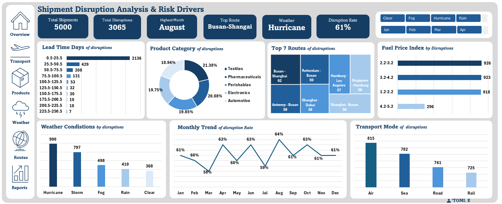

# Shipment Disruption Analysis & Risk Drivers

> **Tools:** Microsoft Excel (Pivot Tables, Charts, Dashboard)
> **Type:** Exploratory Data Analysis + Risk Analysis + Dashboard Design
> **Dataset:** Global supply chain shipment data — 5,000 records

## Project Overview
This project analyses 5,000 global shipment records to uncover the key 
drivers behind supply chain disruptions. The goal was to help logistics 
and operations teams understand what's causing disruptions, on which 
routes, under what conditions, and how frequently — so they can make 
smarter risk management decisions.

Overall disruption rate: **61%** (3,065 out of 5,000 shipments disrupted)

## Steps Taken
1. **Data Familiarisation** — Explored dataset fields: transport mode, 
   weather condition, fuel price index, geopolitical risk score, 
   carrier reliability score, lead time, product category, and route
2. **Data Cleaning** — Standardised data types, checked for nulls, 
   and ensured consistency across 5,000 rows
3. **Pivot Table Analysis** — Built pivot tables for 7 analysis areas:
   transport mode, weather conditions, product categories, fuel price 
   index, monthly disruption trend, top disrupted routes, and lead time
4. **Dashboard Design** — Combined all visuals into one interactive 
   dashboard with KPI summary cards and slicers for weather and month

## Key Findings

| Area | Finding |
|---|---|
| Total Shipments | 5,000 |
| Total Disruptions | 3,065 |
| Overall Disruption Rate | 61% |
| Peak Disruption Month | August — 64% |
| Lowest Disruption Month | March — 58% |
| Top Weather Risk | Hurricane — 990 disruptions |
| Most Disrupted Transport | Air — 815 disruptions |
| Most Disrupted Route | Busan–Shanghai — 62 disruptions |
| Most Disrupted Category | Textiles — 21.38% |
| Highest Fuel Band Disruptions | 2.2–3.2 index — 926 disruptions |
| Highest Lead Time Disruptions | 0.5–25.5 days — 2,136 disruptions |

## Recommendations
- Build weather risk buffers especially during hurricane and storm seasons
- Review short lead time shipments and add contingency scheduling windows
- Investigate and diversify the Busan–Shanghai corridor
- Monitor fuel price index bands 2.2–4.2 as a disruption risk indicator
- Develop route redundancy plans for the top 7 disrupted corridors

## Dashboard Preview

## About
Built by **Oluwatomisin Odeyale** 
Connect on [LinkedIn](https://www.linkedin.com/in/oluwatomisin-odeyale-54631a2a8?utm_source=share&utm_campaign=share_via&utm_content=profile&utm_medium=android_app)
